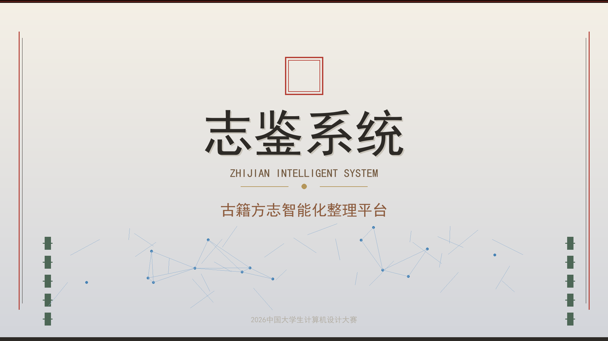
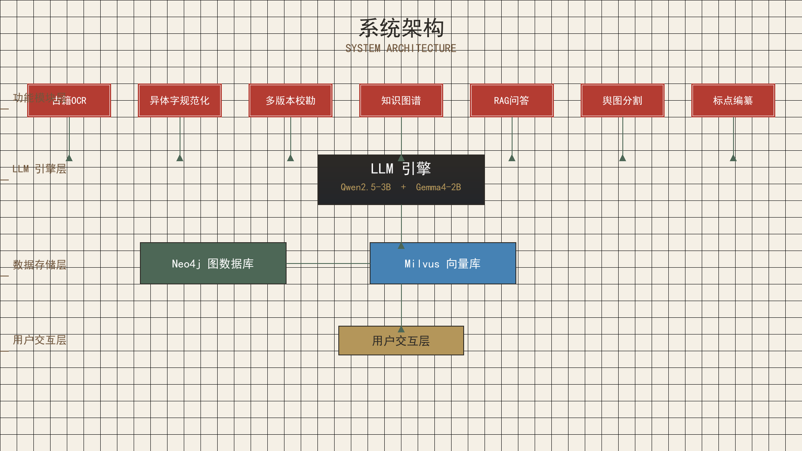
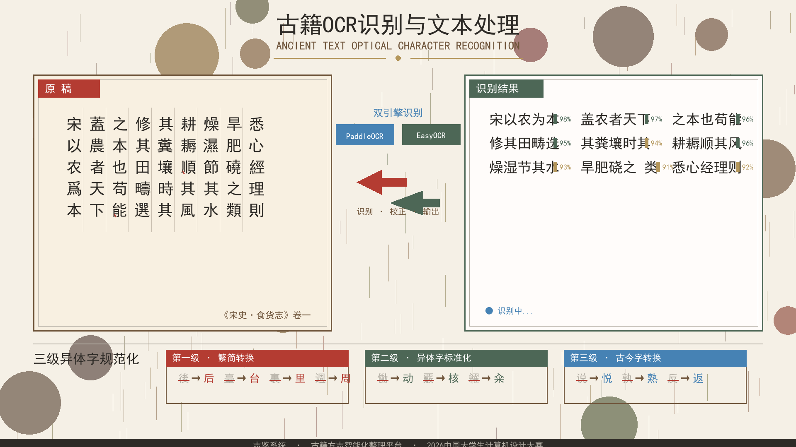
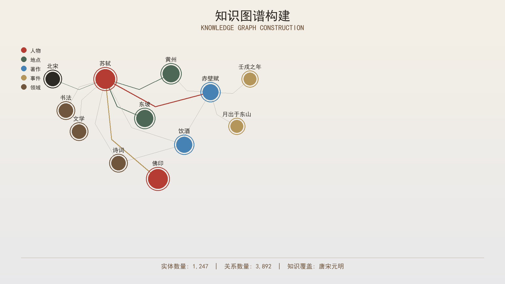
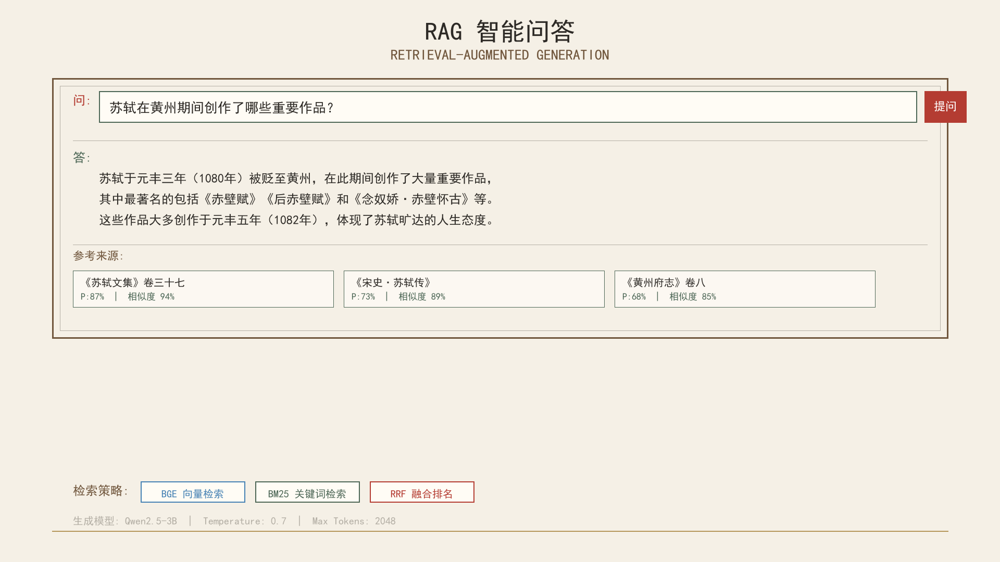

# 「志鉴」古籍方志智能化整理与知识服务平台

<p align="center">
  
</p>

<p align="center">
  
  
  
  
  
  
</p>

---

## 项目概述

中国地方志是特有的文献类型，全国现存超过 **8000 种**，**90% 以上**尚未完成数字化整理。传统人工校勘一部地方志需要 **3-5 年**，且需要领域专家深度参与。

「志鉴」通过 AI 技术将这一过程压缩到 **数天**，实现：

- 古籍扫描件的自动 OCR 识别与异体字/避讳字检测
- 多版本方志的 BERT 语义对齐与差异检测
- 繁简转换、异体字规范化、NER 实体识别
- Neo4j 知识图谱人物关系挖掘与可视化
- 基于 RAG 的古籍智能问答

### 核心指标

| 指标 | 数值 | 说明 |
|------|------|------|
| OCR 识别速度 | ~10 秒/页 | CPU 模式，GPU 可加速 |
| 端到端校勘耗时 | ~269 秒 | 含 BERT 语义编码 |
| 已提取数据量 | 974,139 字符 | 98 年版固安县志 |
| 支持版本数 | 5 个 | 康熙 / 咸丰 / 98年 / 民国 / 故宫 |

---

## 系统架构

<p align="center">
  
</p>

```
古籍扫描件 → OCR识别 → 文本规范化 → 多版本校勘 → 知识图谱 → RAG问答
                                    ↕
                              辑佚 · 舆图 · 批校
```

### 8 大核心模块

| # | 模块 | 核心技术 |
|---|------|----------|
| ① | **古籍 OCR 识别** | EasyOCR / PaddleOCR + 1000+ 异体字映射 + 清代避讳规则 |
| ② | **文本规范化** | OpenCC 繁简转换 + BERT NER（PER/LOC/TIME/ORG/WORK） |
| ③ | **多版本智能校勘** | BERT 语义编码 + Needleman-Wunsch 全局对齐 + 裁判规则引擎 |
| ④ | **多源辑佚与去重** | MinHash 去重 + 版本评分排序 + 结构化融合 |
| ⑤ | **舆图信息提取** | U-Net 语义分割 + 要素矢量化 + 地理坐标映射 |
| ⑥ | **批校痕迹提取** | Faster R-CNN 检测 + 颜色/形状分类 + 文本对齐 |
| ⑦ | **知识图谱** | Neo4j 图数据库 + Milvus 向量索引 + HNSW 检索 |
| ⑧ | **RAG 智能问答** | BGE 向量化 + BM25 混合检索 + RRF 融合 + Ollama/Qwen2.5 |

---

## 功能展示

### OCR 古籍识别

<p align="center">
  
</p>

支持竖排文字、手写体、墨迹不均等古籍特有挑战。内置 1000+ 异体字映射和清代康熙/雍正/乾隆避讳字检测。

### 知识图谱可视化

<p align="center">
  
</p>

从方志文本中自动抽取人物实体和家族/同事/师生关系，ECharts 力导向图可视化，支持点击查看人物详情。

### RAG 智能问答

<p align="center">
  
</p>

基于检索增强生成的古籍问答，支持向量语义检索 + BM25 关键词检索的混合策略，本地 Ollama 部署 Qwen2.5-3B。

---

## 快速开始

### 环境要求

| 组件 | 最低 | 推荐 |
|------|------|------|
| Python | 3.10 | 3.10.5 |
| 内存 | 16 GB | 32 GB |
| 显存 | - | 8 GB (GPU 加速) |
| 磁盘 | 10 GB | 50 GB |
| Node.js | 18 | 20 LTS |

### 1. 后端

```bash
# 创建虚拟环境
conda create -n zhijian python=3.10.5 -y
conda activate zhijian

# 安装依赖
cd zhijian
pip install -r requirements.txt

# 启动 Docker 服务（Neo4j + Milvus，可选）
cd docker && docker-compose up -d

# 启动 API 服务
uvicorn app.main:app --host 0.0.0.0 --port 8000 --reload
```

API 文档自动生成：http://localhost:8000/docs

### 2. 前端

```bash
cd frontend
npm install
npm run dev
```

访问 http://localhost:3000

### 3. 数据准备（可选）

```bash
# 将古籍 PDF/图片放入 data/raw/<版本名>/
# 文本文件放入 data/raw/1998/ 可直接被 RAG ingestion 使用

# 初始化知识图谱（从人物志文本）
curl -X POST "http://localhost:8000/api/v1/kg/init?clear=true"

# 灌入 RAG 知识库
curl -X POST "http://localhost:8000/api/v1/rag/seed?data_dir=data/raw/1998&rebuild=true"
```

---

## API 端点

| 端点 | 方法 | 模块 | 说明 |
|------|------|------|------|
| `/api/v1/ocr/recognize` | POST | OCR | 上传图片进行 OCR 识别 |
| `/api/v1/normalize` | POST | 规范化 | 繁简转换 + NER 实体识别 |
| `/api/v1/collation/compare` | POST | 校勘 | 两版本对比校勘 |
| `/api/v1/collation/compare-multi` | POST | 校勘 | 多版本对比（2-4版本） |
| `/api/v1/collation/versions` | GET | 版本管理 | 列出已保存版本 |
| `/api/v1/collation/versions/upload` | POST | 版本管理 | 上传版本文件 |
| `/api/v1/compilation/compile` | POST | 辑佚 | 多源辑佚编译 |
| `/api/v1/map/extract` | POST | 舆图 | 舆图要素提取 |
| `/api/v1/annotation/extract` | POST | 批校 | 批校痕迹提取 |
| `/api/v1/kg/collation-result` | POST | 知识图谱 | 校勘结果入图 |
| `/api/v1/kg/graph` | GET | 知识图谱 | 图谱可视化数据 |
| `/api/v1/kg/init` | POST | 知识图谱 | 初始化人物图谱 |
| `/api/v1/rag/ask` | POST | RAG | 古籍智能问答 |
| `/api/v1/rag/ingest` | POST | RAG | 文档摄入 |
| `/api/v1/health` | GET | 系统 | 健康检查 |

---

## 项目结构

```
zhijian/
├── app/
│   ├── main.py                # FastAPI 入口
│   ├── api/routes.py          # API 路由（~1900行）
│   ├── ocr/                   # ① OCR 识别
│   ├── normalize/             # ② 文本规范化
│   ├── collation/             # ③ 多版本校勘（核心）
│   ├── compilation/           # ④ 多源辑佚
│   ├── entity_resolution/     #    实体消解
│   ├── map_extraction/        # ⑤ 舆图提取
│   ├── annotation_extract/    # ⑥ 批校提取
│   ├── database/              # ⑦ 知识图谱
│   ├── rag/                   # ⑧ RAG 问答
│   ├── kg/                    #    KG 构建流水线
│   └── llm/                   #    LLM 客户端
├── frontend/                  # Vue3 前端
│   └── src/views/             # 7 个视图组件
├── docker/                    # Docker Compose
├── scripts/                   # 工具脚本（30+）
├── tests/                     # 测试
├── docs/                      # 文档与截图
├── requirements.txt           # Python 依赖
└── CLAUDE.md                  # 项目约定
```

---

## 技术栈

| 层次 | 技术 | 说明 |
|------|------|------|
| 后端框架 | FastAPI 0.109 | 高性能异步 API |
| OCR 引擎 | EasyOCR 1.7 / PaddleOCR 2.7 | 双引擎切换 |
| 深度学习 | PyTorch 2.1 + Transformers 4.37 | BERT / BGE / U-Net / Faster R-CNN |
| NLP 模型 | bert-base-chinese | 语义编码 + NER |
| 向量化 | BGE bge-base-chinese-v1.5 | 768 维嵌入 |
| 图数据库 | Neo4j 5.12 | 人物关系图谱 |
| 向量数据库 | Milvus / ChromaDB | 语义检索 |
| 繁简转换 | OpenCC 0.1.7 | 支持多种中文变体 |
| 前端框架 | Vue 3.4 + Vite 5 | 组合式 API |
| UI 组件 | Element Plus 2.5 | Vue3 组件库 |
| 可视化 | ECharts 5.5 | 知识图谱力导向图 |
| LLM | Ollama + Qwen2.5:3B | 本地部署，中文优化 |
| 容器化 | Docker Compose | Neo4j + Milvus + etcd + MinIO |

---

## 开发进度

| # | 模块 | 状态 | 完成度 |
|---|------|------|--------|
| ① | OCR 识别 | 完成 | variant_map (1000+)、预处理、识别器 |
| ② | 文本规范化 | 完成 | OpenCC、BERT NER |
| ③ | 多版本校勘 | 完成 | NW 对齐、差异检测、裁判规则 |
| ④ | 多源辑佚 | 完成 | MinHash 去重、版本排序、融合 |
| ⑤ | 舆图提取 | 框架完成 | U-Net 模型待训练 |
| ⑥ | 批校提取 | 框架完成 | Faster R-CNN 模型待训练 |
| ⑦ | 知识图谱 | 完成 | Neo4j + in-memory 回退 |
| ⑧ | RAG 问答 | 完成 | 混合检索 + Ollama 本地部署 |
